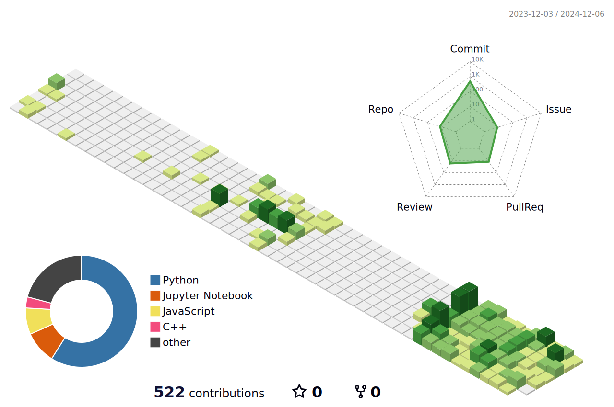

         

    
         

<h4 align='center'>어제보다 나은 내일을 위해 끊임없이 나아가는 서윤하입니다👋🏼</h4>

         

<h3 align='center'>📚Tech Stack📚</h3>
<h4 align='center'>🎧 Languages&Platforms 🎧</h4>

	
	
 	
	
	 
	  
	  
	
	 
	  
	
	

<h4 align='center'>🎧 Tools 🎧</h4>

	  
 	
	

 

 

  <h3>⭐️ Github Stats ⭐️</h3>

 

  <h3>📝 Algorithm 📝</h3>

  <h3>🖥️ Experiences 🖥️</h3>
  <ul>
	<h4 align='left'>2025.07~2025.08 숭실대학교 소프트웨어학부 소프트웨어공모전 금상</h4>
    <h4 align='left'>2025.01~2025.02 <a href='https://www.notion.so/Main-Page-5a0152fdb9ff4c03a920ddfbc2c5cc2f?pvs=4'>LG Aimers 7기 참여</a></h4>  
    <h4 align='left'>2025.03~ 숭실대학교 소프트웨어학부 <a href='https://rpg-ai.org/'>RPG(Robust Perception Group)</a> 학부인턴</h4>
    <h4 align='left'>2025.01~2025.02 <a href='https://www.notion.so/Main-Page-5a0152fdb9ff4c03a920ddfbc2c5cc2f?pvs=4'>LG Aimers 6기 참여</a></h4>  
    <h4 align='left'>2024.07~2025.01 숭실대학교 소프트웨어학부 <a href='https://sites.google.com/view/vmllab'>VML</a> 학부인턴</h4>
    <h4 align='left'>2024.07~2024.08 <a href='https://www.notion.so/Main-Page-5a0152fdb9ff4c03a920ddfbc2c5cc2f?pvs=4'>LG Aimers 5기 참여</a></h4>
    <h4 align='left'>2024.03~2025.01 숭실대학교 IT대학 학생회</h4>
    <h4 align='left'>2022.09~2022.10 제 1회 국방 AI 경진대회(MAICON) 참여</h4>
    <h4 align='left'>2020.03~2022.02 숭실대학교 IT대학 학생회</h4>	  
  </ul>

  <h3>😎 Projects 😎</h3>
  <ul>
    <h4 align='left'>2024.03~2025.08 AI 기반 뉴스 요약 및 추천 서비스 Breifit에서 AI 모델 개발</h4>
    <h4 align='left'>2024.10~2025.01 Brain MRI 데이터 기반의 인지기능 검사 모델 개발</h4>
    <h4 align='left'>2024.09~2024.12 IDM-VTON을 이용한 2D to 3D Virtual Try-On 모델 개발</h4>
    <h4 align='left'>2024.03~2024.06 Bert Model을 이용한 음악 추천 서비스 EMUDA AI 개발</h4>
    <h4 align='left'>2024.03~2024.06 React를 이용한 음악 추천 서비스 EMUDA 프론트엔드 개발</h4>
    <h4 align='left'>2021.08~2022.04 React Native 이용한 스크롤 기반 마음챙김 어플리케이션 <a href='https://www.notion.so/Happy-Flight-9ae8d6193aa5412887bed5be40862774?pvs=4'>Happy Flight </a>개발 참여</h4>
  </ul>

